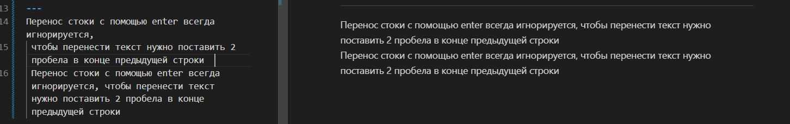

***
# Заголовок 1

1. рома
    + рома
    * супер
    - мужик
2. мачо
3. крутыш
___
## заг 2
абоба
---
Перенос стоки с помощью enter всегда игнорируется,
 чтобы перенести текст нужно поставить 2 пробела в конце предыдущей строки  
 Перенос стоки с помощью enter всегда игнорируется, чтобы перенести текст нужно поставить 2 пробела _в конце предыдущей строки_

Перенос стоки с **помощью** enter всегда ***игнорируется, чтобы перенести текст нужно поставить*** 2 пробела в конце предыдущей строки

`
 $a = 10
`
```
хеллоу ворд
```
>какая-то цитата  
и перенос строки

[мой гитхабчик](https://github.com/riamdi/fold)




Item    |  Value   | Kvakva
:-------|:--------:|-------:
mimi|pipi|gagag
aboba   |abobus    | bebra
ya      | big      |pokemon